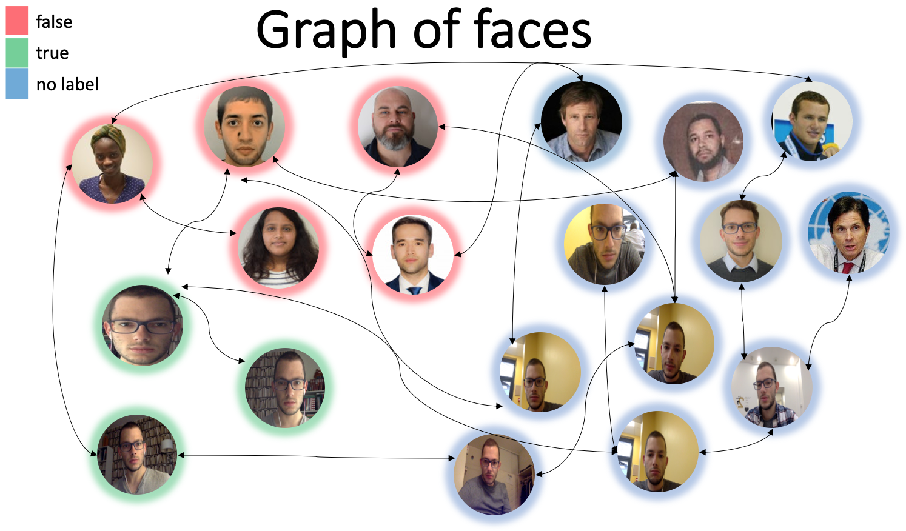

# Face Recognition In A Minute

We were inspired for this work by the following reference:

> *Online Semi-Supervised Perception: Real-Time Learning without Explicit Feedback*, Branislav Kveton, Michal Valko, Mathai Phillipose, Ling Huang, 2010

## Interest of the method

Our philosophy during this work was to be able to work in **real-time fashion** and to be **adaptative**. Therefore to avoid any heavy computation or training time. In some sense we wanted to produce a low-cost method of face recognition. In addition to the fact that only **light computation** is required it is **very little demanding on data**. We used a total of 60 imgs for graph of faces and a training set for PcaNet which consisted of less than 1000 imgs (we even could have used way less of them though). An other interest is the possibility to improve model by simply adding unlabelled imgs (hence **semi-supervised**) to graph. Also authors Branislav Kveton et al. claimed to obtain results using harmonic solution which are **better than using KNN** method.

Thus we used a pre-trained **Viola-Jones** algorithm *Robust Real-time Object Detection*, Paul Viola , Michael Jones, 2001 which has been thought to be fast and small device friendly. 

We also used **PcaNet** model which has a low amount of parameters (roughly 200) and is very fast to learn and yet produces good results (cf https://github.com/salimandre/PcaNet). Although we used our pre-trained PcaNet on LFW as of yet, it would be possible to perform training in real-time fashion.

To produce inference over new face imgs we need to compute one row of **similarity matrix** per unlabelled img then compute an **harmonic extension** of a function over the graph of faces. This takes basically O(|V|) for one frame.

## Our Pipeline

  

**inputs**: 
  * pre-trained Viola-Jones algorithm
  * a dataset of 1000 imgs from different people

**step 1**: choose 10 imgs from stars/personalities which are in some way (gender, age, skin color etc...) similar to you.

These imgs will be added to graph of faces and labelled as false.

**step 2**: take few snapshots (5-10) in real-time of you, varying your pose and your distance to webcam 

These imgs will be added to graph of faces and labelled as true.

**step 3**: compute bounding boxes using Viola-Jones algorithms to detect faces on every imgs.

Perform preprocessing step: crop, convert to grayscale, resize.

  

**step 4**: search of best PcaNet model.

-> Train PcaNet a certain amount of times on current true/false face images.

-> Evaluate on dataset with images of people by computing the % of false positive 

-> Take best model with lowest false positive rate

**step 4**: preprocess faces: extract green channel, cropping, resizing

  

**step 5**: extract features for each face using PcaNet. 
From 1920 features we only kept first 500 of them.

**step 6**: compute one row (per frame) of similarity matrix using L1 distance

  

**step 7**: solve the following optimization problem:

  

by producing the harmonic solution:

  

  

**output**: display on current frame.

## Results

Before going for real time inference we experimented on stored imgs.  

We used roughly 50 imgs 

  

## Limits

* Viola does not capture well changes of pose therefore to detect a face we need it to be mostly frontal

* we do not use a pre-trained segmentation tool to extract faces from background in bounding boxes.

