# Face Recognition In One Minute

We were inspired for this work by the following reference:

> *Online Semi-Supervised Perception: Real-Time Learning without Explicit Feedback*, Branislav Kveton, Michal Valko, Mathai Phillipose, Ling Huang, 2010

## Interest of the method

Our philosophy during this work was to be able to work in **real-time fashion**. Therefore to avoid any heavy computation or training time. In some sense we wanted to produce a low-cost method of face recognition. In addition to the fact that only **light computation** is performed, it does not require any prior **domain knowledge** and it is **little demanding on data**. It only requires a dataset of raw 1000 imgs with people on them without any label required. We used **LFW-funneled** dataset available online for free. An other strong interest is the possibility to improve model by simply adding unlabelled imgs (hence **semi-supervised**) to graph. That's what we used at boosting step with success. Also authors Branislav Kveton et al. claimed to obtain results using harmonic solution which are **better than using KNN** method.

Thus we used a pre-trained **Viola-Jones** algorithm *Robust Real-time Object Detection*, Paul Viola , Michael Jones, 2001 which has been thought to be fast and small device friendly. 

We also used **PcaNet** model which has a low amount of parameters (roughly 200) and is very fast to learn and yet produces good results (cf https://github.com/salimandre/PcaNet).

To produce inference over new face imgs we need to compute one row of **similarity matrix** per unlabelled img then compute an **harmonic extension** of a function over the graph of faces. This takes basically O(|V|^3) for one frame.

## Our Pipeline

**inputs**: 
  * pre-trained Viola-Jones algorithm
  * a dataset of 1000 imgs from different people

**step 1**: choose 10 imgs from stars/personalities which are in some way (gender, age, skin color etc...) similar to you. We downloaded ours from google images. Note: this step could be spared, as explained in Results.

These imgs will be added to Graph Of Faces and labelled as false.

  

**step 1**: take few snapshots (5-10) in real-time of you, varying your pose and your distance to webcam 

These imgs will be added to Graph Of Faces and labelled as true.

  

  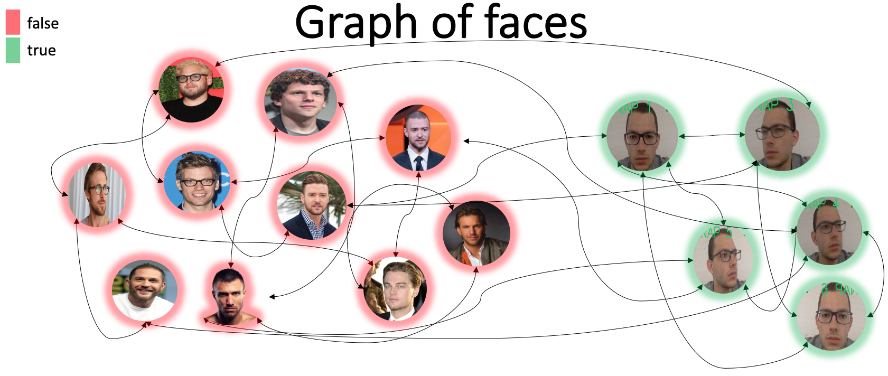

**step 2**: compute bounding boxes using Viola-Jones algorithms to detect faces on every imgs.

Perform preprocessing step: crop, convert to grayscale, resize.

 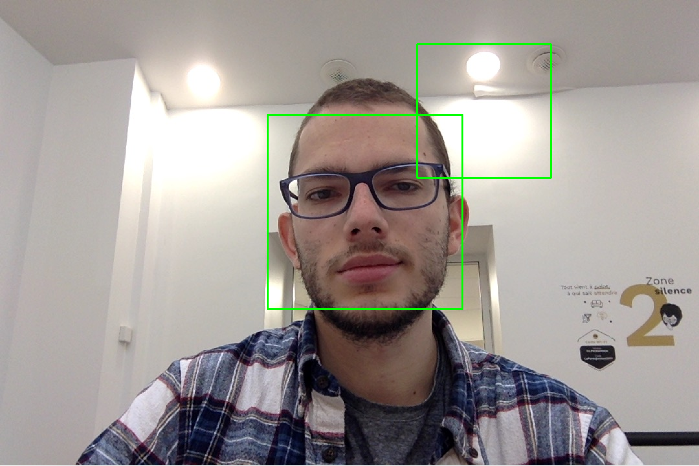
 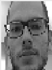
 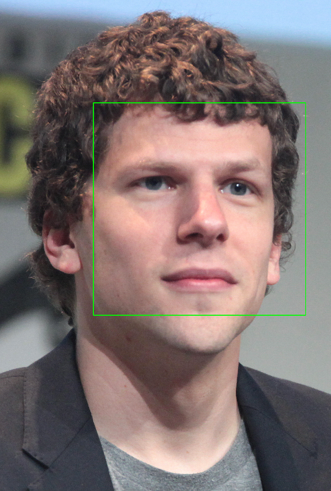
 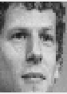
 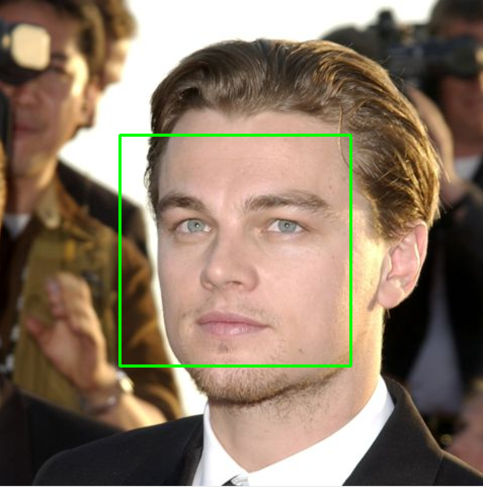
 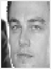

**step 3**: search of best Graph Of Faces.
  
  - repeat a certain amount of times (5-10):
  
    - **Sample Images** (3-10) from LFW-funneled dataset. 
    - 

    - **Extract faces** compute bounding boxes using Viola-Jones algorithms to detect faces on every imgs.   
    
    Perform preprocessing step: *crop*, convert to *grayscale*, *resize*.
    
    Faces from LFW-Funneled labelled as *false* while faces from snapshots will be labelled as *true*

    - 

    - **Train PcaNet** on current true/false face images.
    - **Inference** of features on faces
    - **Evaluate** Graph Of Faces + PcaNet model
     
      - repeat 100 times:
      
        - **sample** randomly an image from dataset:
      
        - **compute** one row of **similarity matrix** using L1 distance
        - 

        - 
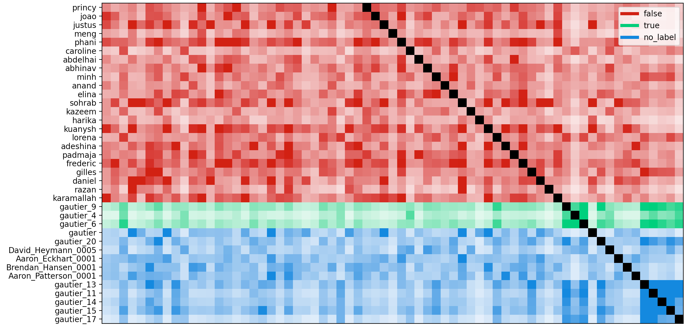

        - **solve** the following optimization problem:
        - 
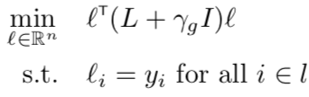

        - by producing the harmonic solution:

        - 
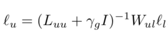

        - compute the % of **false positive** 
   - Take **best model** with lowest false positive rate

**step 5**: Perform Boosting step by randomly choosing (10-50) faces from dataset which are barely classified as False by Graph Of Faces model. These nodes should be referred as boosting nodes or support nodes.

  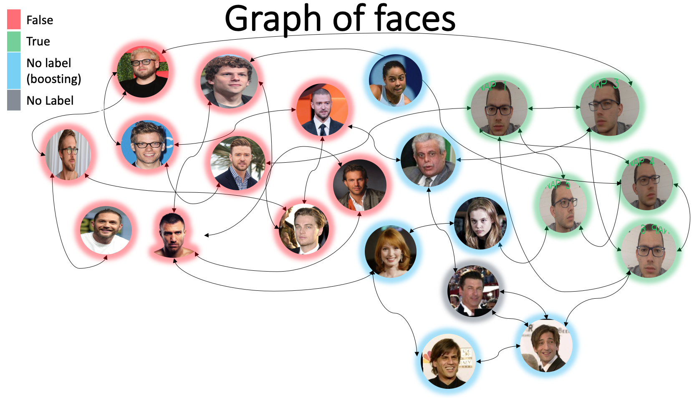

**step 6**: Perform inference using boosting on frame.

For each frame perform "all in one" inference for both current frame and for faces chosen at previous steps.

  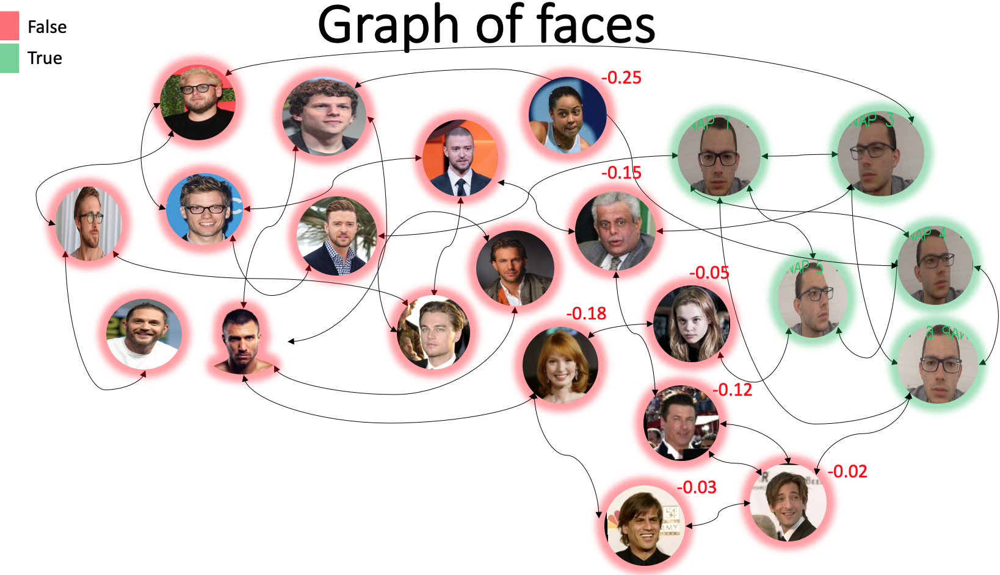

## Results

We used the following **settings**: 10 imgs of stars showed above, 6 snapshots, 8 runs to find best PcaNet model evaluated on 100 random imgs from **LFW-funneled dataset**, found 40 support nodes among 250 random imgs. 

We **evaluated** the false positive rate on 1000 random imgs from LFW-funneled and we obtained **2.2%**. 

**Running time**: Snapshots took 12s (1 every 2s) + 1:09 of computations

  

  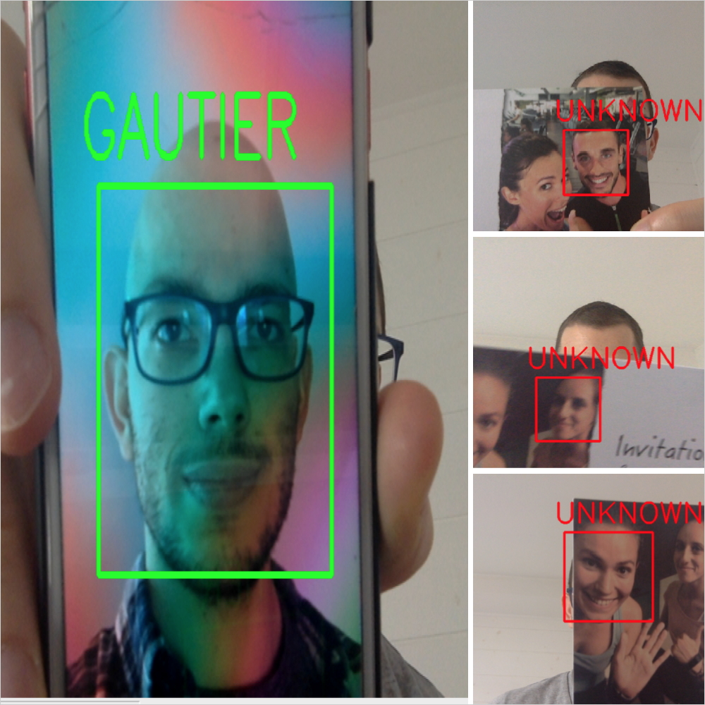

**Note**: If we wanted to start without star images (images for false labels) it is possible search them among the LFW-Funneled db. We computed 10 runs instead on 8 above in order to find best model and best 5 false labelled images. We could get similar results.

## Limits

* Viola-Jones detection method does not capture well changes of pose therefore to detect a face we need it to be mostly frontal

* we do not use a pre-trained segmentation tool to extract faces from background in bounding boxes.

* We used resised imgs (50,37) to feed into PcaNet in order to limit the number of features to 1920 (with our own current version of PcaNet we lack of flexibility) but with an other model (MobileNet?) it may be possible to use bigger imgs and have same quality of features or even better.

* Sensible to illumination
